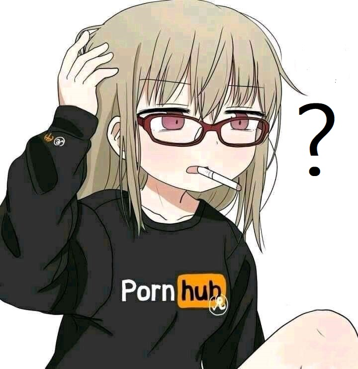

<p align="center">

</p>
<p align="center">

<p align="center">
 
 
 <p align="center">

</p>
<p align="center">
<a href="#"></a>
</p>
<p align="center">
<a href="https://github.com/mhankbarbar"></a>
</p>
<p align="center">
<a href="https://github.com/mhankbarbar/followers"></a>
<a href="https://github.com/mhankbarbar/termux-wabot/stargazers/"></a>
<a href="https://github.com/mhankbarbar/termux-wabot/network/members"></a>
<a href="https://github.com/mhankbarbar/termux-wabot/watchers"></a>
<a href="https://www.codefactor.io/repository/github/mhankbarbar/termux-wabot"></a>
<a href="#">
</p>
 
 
𝗠𝗜𝗦 𝗖𝗢𝗡𝗧𝗔𝗖𝗧𝗢𝗦
<p align="center">
<a href="http://wa.me/18299897014" target="blank"></a>
<a href="http://www.instagram.com/the_choute_" target="blank"></a>
<a href="https://www.youtube.com/channel/UC-HPutaDGeTPjrCId0bXQgg" target="blank"></a>
<p align="center">
</p>

### PROCESO DE INSTALACION
Instala los archivos necesarios
```bash
- pkg upgrade && update
- pkg install nodejs
- pkg install git
- pkg install bash
```

Clona este repositorio
 ```bash
> git clone https://github.com/thechoute/BabyBechoso
```

Inicia la instalacion
```bash
- cd Baby-Ofc
- bash install.sh
```

Para Iniciar el Bot
 ```bash
- node thechoute
```
### PARA WINDOWS/VPS/RDP USER💻

- Pulsa Para Instalar Git [`Click Here`](https://git-scm.com/downloads) <br>
- Pulsa Para Instalar NodeJS [`Click Here`](https://nodejs.org/en/download) <br>
- Pulsa Para Instalar FFMPEG [`Click Here`](https://ffmpeg.org/download.html) 
- Pulsa Para Instalar ImageMagick [`Click Here`](https://imagemagick.org/script/download.php)
